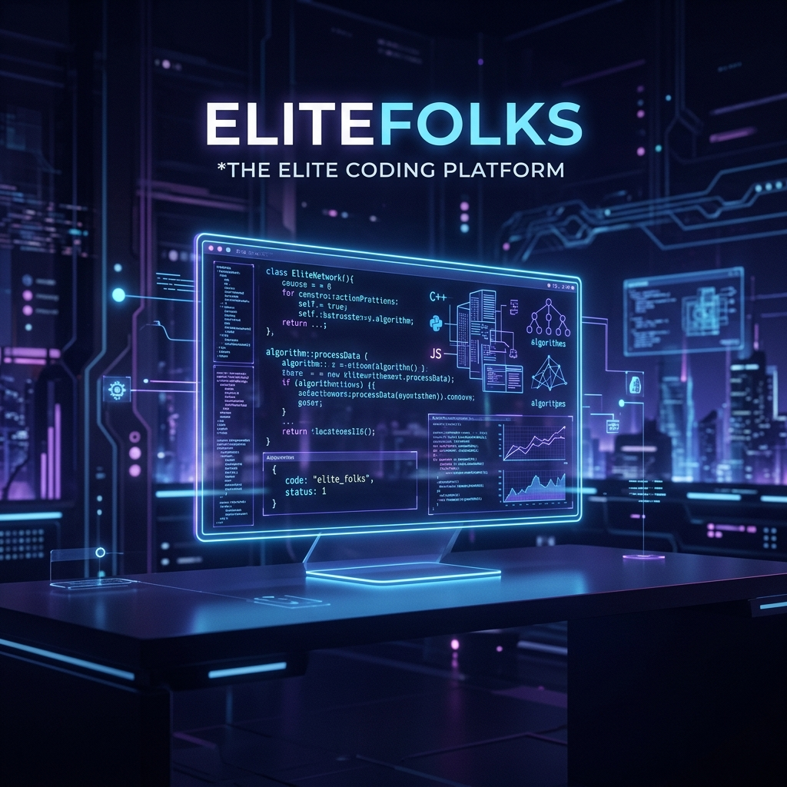
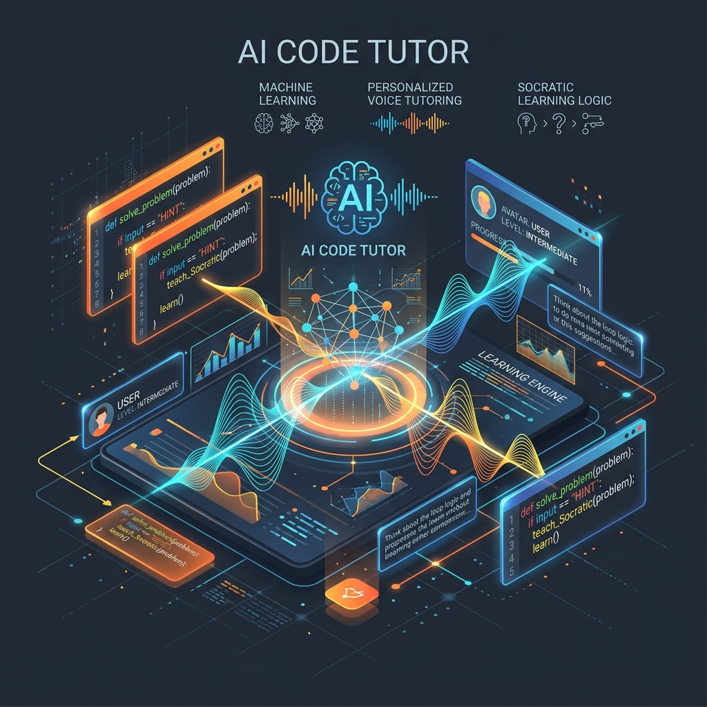
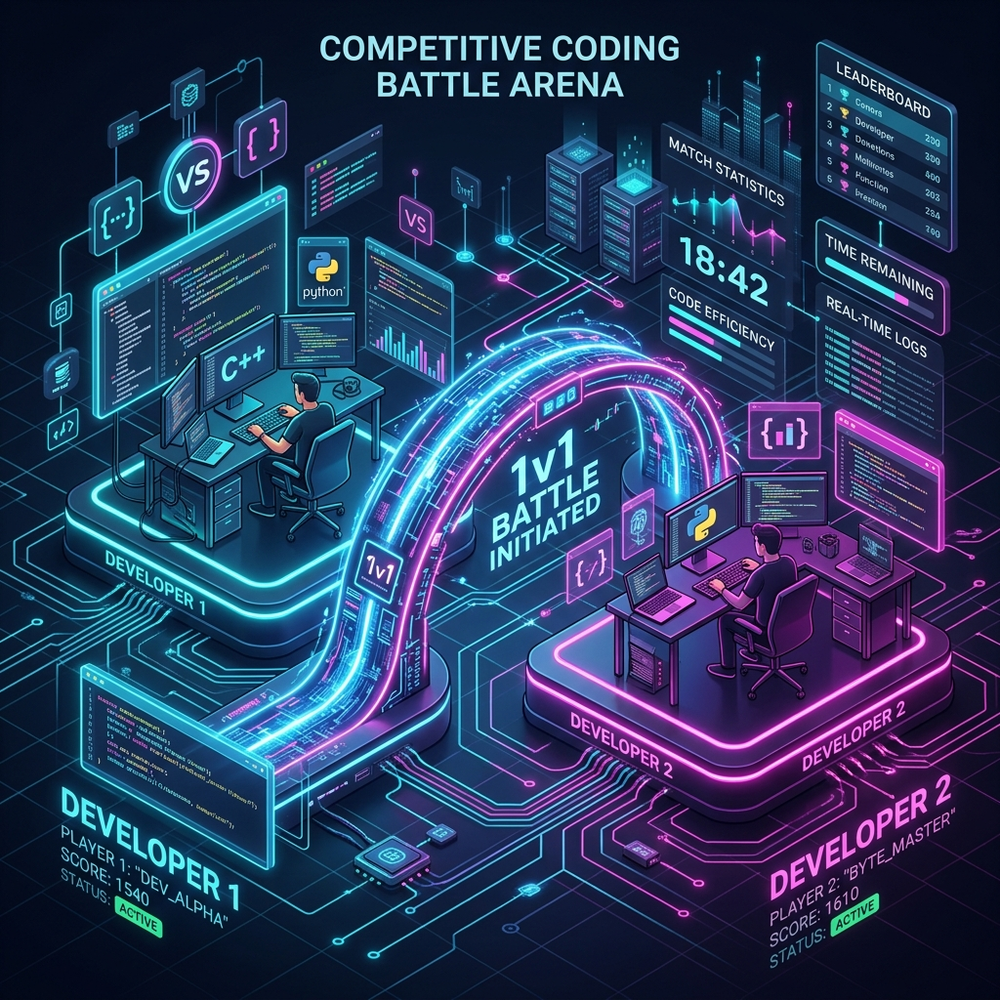

<div align="center">
  
  <br/>
  <br/>
  
  <h1>EliteFolks | Next-Generation Technical Assessment & Learning</h1>
  <p><strong>A Showcase of Engineering, UI/UX, and AI Integration</strong></p>
  <h3>🌐 <a href="https://elitefolks.com/">Experience the Live Platform at EliteFoaks.com</a></h3>
</div>

<br/>

> ⚠️ **Important Security Notice (Showcase Only)**
> 
> This repository is a **Public Showcase / Sanitized Replica** of the EliteFolks frontend. 
> Because EliteFolks handles proprietary evaluation algorithms, enterprise B2B hiring data, complex AI streaming logic, and secure code-sandboxing, the original source code cannot be made public. 
> 
> In this repo:
> - **All Backend & AI Logic is Mocked:** Real API keys, database schemas, and AI endpoints have been entirely stripped.
> - **Mock Data Installed:** Actions that normally trigger heavy backend jobs (like executing code or voice chats) respond with dummy data to simulate the UI safely. 
> - **Visually Authentic:** The interface, routing, and component architecture remain untouched so you can explore our engineering quality.
> 
> To experience the *real* functional application out in the wild with full algorithms and live data, **[Visit our live production deployment at EliteFoaks.com!](https://elitefolks.com)**

---

## 🌟 Platform Overview

EliteFolks isn't just another coding platform—it is a comprehensive bridge between **AI-tutored developer education** and **B2B technical hiring assessments**. We combine a high-fidelity gamified learning environment with enterprise-grade candidate assessment tools.

Our architecture connects an immersive frontend (built on Next.js, Framer Motion, and GSAP) with a proprietary backend that leverages Google Gemini for true Socratic voice conversations, and strict sandboxed environments (Judge0) for secure code execution.

---

## 🚀 Core Features 

### 1. 🎤 The AI Socratic Live Tutor
Unlike standard chatbots, our AI tutor acts as a **true mentor**. It is explicitly programmed *never to give away the answer*. 
- **Voice & Text Interactivity:** Talk aloud to the AI using your microphone; it listens, reads your current editor code in real-time, and responds contextually.
- **Micro-State Awareness:** The tutor knows exactly where your cursor is and what lesson you are struggling with.
- *(Note: In this showcase repo, the voice capabilities are mocked strictly for visual demonstration).*

<div align="center">
  
</div>

### 2. ⚔️ Competitive 1v1 Battle Arena
The Battle Arena introduces a high-stakes, competitive programming space.
- **Ranked Matchmaking:** Users face off against peers of similar skill ratings.
- **Live Leaderboards:** Climb the global competitive ladder.
- **Spectator Modes:** Watch complex logic battles unfold in real-time.

<div align="center">
  
</div>

### 3. 🏢 B2B Hiring & Assessments Portal
EliteFolks powers hiring for top organizations. 
- **Automated Anti-Cheat Proctoring:** Incorporates screen-switching detection, webcam monitoring, and plagiarism heuristics.
- **Deep Candidate Analytics:** Generates comprehensive PDF reports of a candidate's logic process, not just whether their code passed or failed.
- **Custom Hiring Pipelines:** Employers can create targeted templates (e.g., Senior React Dev, Junior Go Lang Engineer) and invite candidates via secure URLs.

### 4. 🧠 Deep Tech Training (DSA & Logic)
We replace boring textbooks with visually stunning interactive courses.
- **In-Browser IDE:** A deeply integrated Monaco Editor featuring syntax highlighting, multi-language support (Python, JS, C++, Go, Rust, Java), and terminal outputs.
- **Visual Memory Models:** Complex concepts (like pointers and recursion) are rendered visually directly alongside the problem description.
- **Daily Quests & Streaks:** Gamification elements keep users consistently motivated.

### 5. 💎 Gamification, Shop & Inventory
- **XP Progression:** Earn experience points by solving algorithmic challenges.
- **Virtual Economy:** Spend earned points in the platform shop to unlock cosmetic IDE themes, profile banners, and unique AI tutor personalities.
- **Achievements:** Earn badges for milestones across different programming languages and competitive ranks.

---

## 🛠 Technical Architecture

This application was engineered with a focus on high-performance rendering and complex state management across highly interactive surfaces.

### **Frontend Infrastructure**
- **Framework:** Next.js (App Router) + React 19
- **State Management:** React Context API + Custom hook abstractions (`useCourseProgress`, `useLiveTutor`, `useCodeExecution`)
- **Styling:** Tailwind CSS integrated with customized SCSS for specialized layouts
- **Animations:** GSAP (ScrollTrigger, Flip), Framer Motion, and Spline 3D natively integrated for a premium, heavy-duty visual experience.
- **Code Editor:** Monaco Editor customized with advanced workers and Pyodide.

### **Backend Infrastructure (Proprietary / Excluded)**
*Our private backend architecture revolves around:*
- **Appwrite:** Handles server-side databases, Auth, and highly scalable microservice functions.
- **Edge LLM Processing:** Native streaming integrations with Anthropic Claude and Google Gemini via raw stream pipelining.
- **Secure Code Execution:** Ephemeral Docker containers processing arbitrary untrusted code via Judge0 APIs.
- **TTS/STT:** Streaming bidirectional audio for the Voice Tutor using Web Audio APIs and intelligent Voice Activity Detection (VAD).

---

## 🏃‍♂️ Running the Showcase Locally

Even though the APIs are stripped, you can safely clone and run this application purely as a frontend Next.js project. Our custom `mockProxy` interceptors will trick the UI into believing a server exists, providing dummy authentication and responses out of the box!

```bash
# 1. Clone the Showcase Repository
git clone https://github.com/Atul-Chahar/elitefolks_showcase.git
cd elitefolks_showcase

# 2. Enter the frontend directory
cd frontend

# 3. Install dependencies (Legacy flags used to bypass React 19 peer-dependency warnings)
npm install --legacy-peer-deps

# 4. Start the Development Server
npm run dev
```

Finally, open your browser and navigate to `http://localhost:3000`. You will be automatically logged in as a "Showcase Viewer".

---

## 📚 Further Information
Curious about how we orchestrate the AI prompts, handle Sandboxing, or design data relations without exposing them?
Check out the [`/docs/architecture.md`](docs/architecture.md) file inside this repository for an extended system design overview.

*Built with ❤️ by the EliteFolks Engineering Team.*
