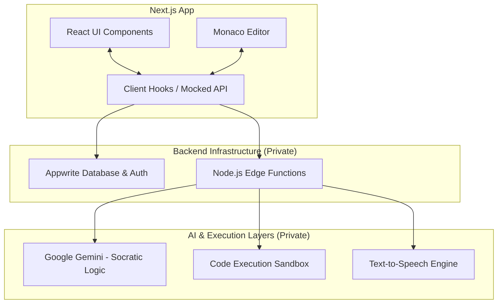

# System Architecture Overview

This document outlines the high-level architecture of the full EliteFolks application. Since this repository is a **Public Showcase**, all proprietary backend logic has been mocked. However, the system relies on a robust and scalable architecture for its production environment.

## High-Level Diagram

## 1. Frontend Layer
- **Next.js & React 19:** Powered by the App Router system for high performance, server-side-rendered pages, and optimal loading states.
- **State & Context:** Leverages React Context for global structures (like Auth and Theme) and custom lightweight hooks (e.g., `useVoiceAgent`) for micro-states tied to a lesson loop.

## 2. API & Data (Mocked here) 
- Our backend traditionally revolves around an open-source Appwrite instance, executing server-side logic in a heavily guarded Next.js `app/api` directory layer.

## 3. Sandboxed Execution (Mocked here)
- User algorithms written in the Monaco Editor are wrapped in test suites dynamically, submitted to secure sandboxed execution containers, and verified against edge cases. Memory limits and timeouts are strictly enforced.

## 4. AI Copilot Engine (Mocked here)
- The Voice and Chat Tutors use specialized prompting systems fed the user's *current code*, *cursor position*, and *lesson context constraints*. The AI is forbidden from explicitly giving the final solution code, operating as a true learning companion.
